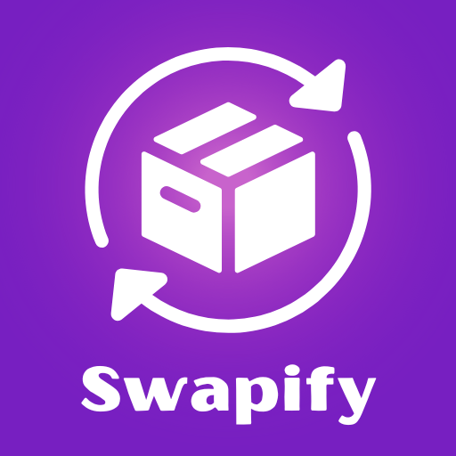

#  Swapify - Secondhand eMarketplace

A modern marketplace application that enables users to buy used products seamlessly across multiple platforms.

[🔗 Visit Site](http:swapify.club)

## 🚀 Tech Stack

### Frontend (Web)
- **Next.js** - React framework for production
- **React** - JavaScript library for building user interfaces
- **TailwindCSS** - Utility-first CSS framework
- **TypeScript** - Type-safe JavaScript

### Backend (API)
- **Express.js** - Fast, unopinionated web framework for Node.js
- **MongoDB** - NoSQL database for flexible data storage
- **Node.js** - JavaScript runtime environment

### Mobile App
- **React Native** - Cross-platform mobile development framework

### Additional Tools & Services
- **Appwrite** - Backend-as-a-Service platform
- **JWT** - JSON Web Tokens for authentication
- **Mongoose** - MongoDB object modeling for Node.js

## 📁 Project Structure

```
Swapify/
├── swapify_frontend/     # Next.js web application
├── swapify_backend/      # Express.js API server
├── swapify_app/          # React Native mobile app
└── README.md            # This file
```

## ✨ Features

- **User Authentication** - Secure login/registration with JWT tokens
- **Google OAuth** - Social login integration
- **Listing Management** - Create, edit, and delete marketplace listings
- **Location-Based Search** - Find items nearby using geolocation
- **Real-time Chat** - Message other users about listings
- **Image Upload** - Upload and manage listing photos
- **Profile Management** - User profiles and settings
- **Mobile App** - Cross-platform mobile experience
- **PWA Support** - Progressive Web App capabilities
- **Responsive Design** - Works on all device sizes

## 🛠️ Installation & Setup

### Prerequisites
- Node.js (v16 or higher)
- MongoDB (local or Atlas)
- Git

### Backend Setup

1. Navigate to the backend directory:
```bash
cd swapify_backend
```

2. Install dependencies:
```bash
npm install
```

3. Create a `.env` file:
```bash
MONGODB_URI=mongodb://localhost:27017/swapify
JWT_SECRET=your_jwt_secret_here
GOOGLE_CLIENT_ID=your_google_client_id
GOOGLE_CLIENT_SECRET=your_google_client_secret
EMAIL_USER=your_email@gmail.com
EMAIL_PASS=your_email_password
```

4. Start the server:
```bash
npm start
```

### Frontend Setup

1. Navigate to the frontend directory:
```bash
cd swapify_frontend
```

2. Install dependencies:
```bash
npm install
```

3. Create a `.env.local` file:
```bash
NEXT_PUBLIC_API_URL=http://localhost:3001
NEXT_PUBLIC_APPWRITE_ENDPOINT=your_appwrite_endpoint
NEXT_PUBLIC_APPWRITE_PROJECT_ID=your_appwrite_project_id
NEXT_PUBLIC_APPWRITE_BUCKET_ID=your_appwrite_bucket_id
GOOGLE_CLIENT_ID=your_google_client_id
GOOGLE_CLIENT_SECRET=your_google_client_secret
NEXTAUTH_URL=http://localhost:3000
NEXTAUTH_SECRET=your_nextauth_secret
```

4. Start the development server:
```bash
npm run dev
```

### Mobile App Setup

1. Navigate to the mobile app directory:
```bash
cd swapify_app
```

2. Install dependencies:
```bash
npm install
```

3. For iOS:
```bash
cd ios && pod install && cd ..
npx react-native run-ios
```

4. For Android:
```bash
npx react-native run-android
```

## 🌐 API Endpoints

### Authentication
- `POST /api/auth/register` - User registration
- `POST /api/auth/login` - User login
- `POST /api/auth/forgot-password` - Password reset request
- `POST /api/auth/reset-password` - Password reset

### Listings
- `GET /api/listings` - Get all listings
- `GET /api/listings/:id` - Get single listing
- `POST /api/listings` - Create new listing
- `PUT /api/listings/:id` - Update listing
- `DELETE /api/listings/:id` - Delete listing
- `GET /api/listings/nearby` - Get nearby listings

### User Management
- `GET /api/user/:id` - Get user profile
- `PUT /api/user/:id` - Update user profile
- `GET /api/my-listings` - Get user's listings

### Chat
- `GET /api/chat` - Get user's chats
- `POST /api/chat` - Create new chat
- `GET /api/chat/:id` - Get chat messages

## 🔧 Development Scripts

### Frontend
```bash
npm run dev          # Start development server
npm run build        # Build for production
npm run start        # Start production server
npm run lint         # Run ESLint
```

### Backend
```bash
npm start            # Start server
npm run dev          # Start with nodemon
```

### Mobile App
```bash
npm start            # Start Metro bundler
npm run android      # Run on Android
npm run ios          # Run on iOS
```

## 📱 Mobile App Features

- Cross-platform compatibility (iOS & Android)
- Native performance with React Native
- Push notifications
- Camera integration for listing photos
- GPS location services
- Offline capability

## 🔒 Security Features

- JWT-based authentication
- Password hashing with bcrypt
- Input validation and sanitization
- Protected routes and middleware
- CORS configuration
- Rate limiting

## 🎨 UI/UX Features

- Modern, responsive design
- Dark/light mode support
- Smooth animations and transitions
- Mobile-first approach
- Accessibility compliance
- PWA capabilities

## 🤝 Contributing

1. Fork the repository
2. Create a feature branch (`git checkout -b feature/amazing-feature`)
3. Commit your changes (`git commit -m 'Add amazing feature'`)
4. Push to the branch (`git push origin feature/amazing-feature`)
5. Open a Pull Request

## 📄 License

This project is licensed under the MIT License - see the [LICENSE](LICENSE) file for details.

## 👥 Team

- Frontend Development: Next.js, React, TailwindCSS
- Backend Development: Express.js, MongoDB, Node.js
- Mobile Development: React Native
- Authentication: JWT, Google OAuth
- Database: MongoDB with Mongoose

## 📞 Support

If you have any questions or need help with setup, please open an issue or contact the development team.

---

**Happy Swapping! 🔄** 
